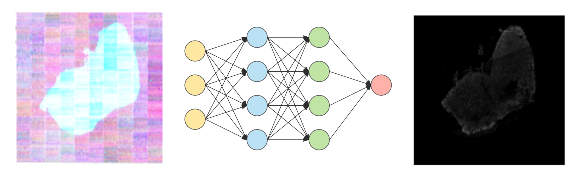

# stpt2imc

[View Full Report (PDF)](./reports/Final_Report.pdf)

## Introduction
Cancer research has greatly benefited from advanced imaging technologies that reveal properties of tumor morphology and protein distribution. Serial Two-Photon Tomography (STPT) and Imaging Mass Spectrometry (IMC) are two such techniques, providing complementary insights into tumor structure and proteomics. However, obtaining both data types for a single tissue sample is challenging due to alignment difficulties and high costs. To address this, we introduce a generative model that predicts IMC images from STPT data. This approach aims to inform clinical decision-making by offering a cost-effective solution to visualize both morphological and proteomic modalities.

## Overview

Serial Two-Photon Tomography (STPT) and Imaging Mass Spectrometry (IMC) are two popular imaging techniques in tumour analysis. STPT images describe tumour morphology, whereas IMC images describe protein abundance. Having both data modalities for the same tissue sample is often beneficial in clinical applications, as understanding the tumour landscape from both a morphological and proteomic perspective can inform treatment decisions. However, it is difficult to obtain both data modalities for a single tissue sample. To mitigate this issue, we present a Generative Model that, for the same tissue sample, only requires STPT images to impute corresponding IMC images. 18 aligned STPT and IMC physical sections have been identified and have been used for training two neural network models. The first model was based on the well known U-Net architecture, and the second model was based on a network designed for point clouds, called PointSetGen. The first model produced poor reconstruction results. The second model was not able to be trained because of hardware limitations and numerical instability and requires further attention.

<em>Figure: Schematic of the stpt2imc pipeline. The model takes a STPT image as input and outputs an IMC image.</em>
